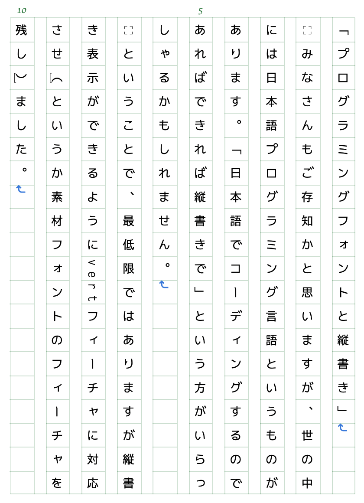
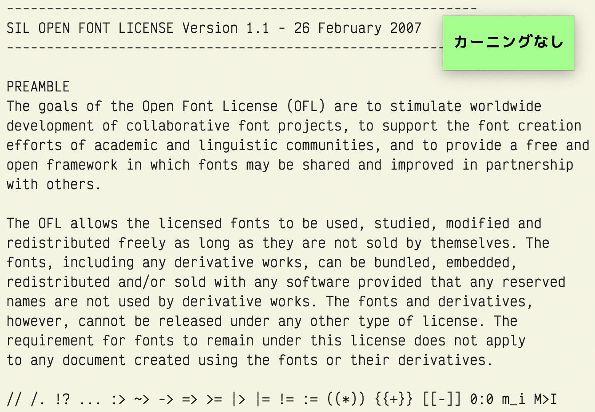
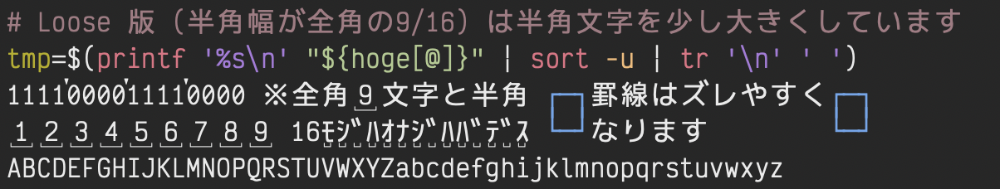
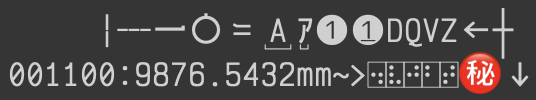
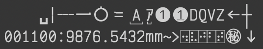

# 全角英数や半角カナが判別しやすい、文字間隔調整機能付き等幅フォント「Viroit」

Viroit (ゔぃろいと) はコーディングにもお使いいただける日本語等幅フォントです。  
自作合成フォント [Cyroit](https://omonomo.github.io/Cyroit/) にプログラミングフォント [Victor Mono](https://rubjo.github.io/victor-mono/) を合成した姉妹フォントになります。  
ウェイト軽めの英数フォントを合成した日本語フォントは少ない気がしたので作ってみました。

全角英数記号や半角カナ等にアンダーラインが引いてあるため、全角・半角の組み合わせになっている括弧や、誤って使われている全角チルダなどをすぐに見つけることができます。  
また calt を利用したカーニング機能を実装しており、ラテン文字は等幅のまま前後の文字に合わせて文字間隔を調整します。

その他にも全角・半角・ノーブレークスペースを可視化したバージョンや自動で桁区切りマークを表示するバージョン、カラー絵文字フォントとの併用を前提として絵文字を減らしたバージョンなども用意してあり、使い分けて使用できます。

英数文字が窮屈に感じられる方は、半角と全角の横幅の比率を9:16にしたバージョンもございますので、お好みによりお選びください。

フォント生成用のスクリプトを利用すれば、必要な機能のみ実装したフォントを作っていただくこともできます。

## フォントサンプル

[CotEditor](https://coteditor.com) にて  


[warp](https://www.warp.dev) + [Starship](https://starship.rs/ja-JP/) + [lsd](https://github.com/lsd-rs/lsd) にて  


[egword Universal2](https://www.monokakido.jp/ja/mac/egworduniversal2/) にて  


カーニングサンプル  


桁区切り表示サンプル  


半角幅の違いサンプル (上: 1/2、下: 9/16)  
  


追加した記号等のコードポイント  


## ダウンロード

最新版 v1.0.0 (2025-02-26)

| リンク                                                                                                      | 説明                                   |
| ----------------------------------------------------------------------------------------------------------- | -------------------------------------- |
| [フォント (Viroit)](https://github.com/omonomo/Viroit/releases/download/v1.0.0/Viroit_v1.0.0.zip)           | 通常版。半角幅が全角の1/2。            |
| [フォント (ViroitLoose)](https://github.com/omonomo/Viroit/releases/download/v1.0.0/ViroitLoose_v1.0.0.zip) | 文字間隔ゆるい版。半角幅が全角の9/16。 |
| [ソースコード](https://github.com/omonomo/Viroit/archive/refs/tags/v1.0.0.zip)                              | 使用方法は下の方にあります。           |

フォントやスクリプトの使用は自己責任にてお願いいたします。  
各ファイルを使用することで生じた不具合・損害等について omonomo は責任を負いません。  
[ライセンス](#ライセンス)に従ってのご使用をお願いいたします。

## その他の特徴

- 主にラテン文字、ギリシア文字、キリル文字のグリフは [Victor Mono](https://rubjo.github.io/victor-mono/) を使用しています。
- 主に仮名文字のグリフは [Circle M+ 1m](https://itouhiro.github.io/mixfont-mplus-ipa/) を使用しています。
- 主に漢字のグリフは [BIZ UDゴシック](https://github.com/googlefonts/morisawa-biz-ud-gothic) を使用しています。
- 主に変体仮名のグリフは [NINJAL 変体仮名フォント](https://cid.ninjal.ac.jp/kana/font/) を使用しています。
- [Nerd Fonts](https://www.nerdfonts.com) を追加しています。
- [Cyroit](https://omonomo.github.io/Cyroit/) に Victor Mono を合成したため、[Inconsolata](https://levien.com/type/myfonts/inconsolata.html) 由来のグリフも含まれます。
- [ricty_generator](https://rictyfonts.github.io) を Fork したスクリプトで自動生成させています。
- フォント生成時にグリフの改変や調整、追加を行っています。追加分も含め、全てのグリフは素材フォントの組み合わせだけで作られています。

### ラテン文字について

- Cyroit のグリフに合わせるために全体的にサイズや縦横比を調整しています。
- 上付き、下付き文字は少し拡大しています。
- 0 は Victor Mono が持っているサブのグリフを採用しています。
- 一部の文字や記号について、グリフの形状や表示座標を微調整しています。
- オブリーク体は新規に生成し直しています。

### 仮名文字について

- Cyroit からの変更はありません。
- 一部のひらがなを教科書体っぽく改変 (跳ねたり突き抜けたり別れたり) しています。
- 濁点、半濁点の大きさや位置を変更しています。
- イコールと区別しやすいようにダブルハイフンの先端を少し折っています。
- その他のグリフについても、他の素材フォントとのバランスをとるため等の微調整を施しています。
- 小書き仮名拡張に対応しています。また見た目に統一感はないですが、変体仮名の表示にも対応しています。

### 漢字について

- Cyroit からの変更はありません。
- カタカナや図形の○などと区別しやすいように一部の漢字にウロコを追加しています。
- いわゆる土吉 (吉の異体字) を追加しています。
- その他のグリフについても、他の素材フォントとのバランスをとるための微調整を施しています。

### 記号類について

- 半角の矢印や装飾記号などは全角に改変しています。
- ダッシュや縦棒など、形状の似た記号と区別しやすいように実線を破線に改変している記号があります。
- 点字や漢字構成記述文字、キーボードショートカット、製図記号などを少し追加しています。
- Nerd Fonts は他の素材フォントとのバランスをとるために、一部を除いてサイズを調整しています。
- また Nerd Fonts には、Ver.3.3.0 から [Fira Code](https://github.com/tonsky/FiraCode) 由来の[プログレスバー](https://github.com/tonsky/FiraCode/blob/master/extras/progress.png)のグリフが加わっていますが、独自に製作したのグリフに置き換えています。

### 機能的なものについて

- Cyroit の特長を継承しています。
- Victor Mono の機能の一つでもあるリガチャには対応していません。
- IVS を利用した漢字の異体字表示に対応しています。
- ccmp によるアイヌ語カナ表記に対応しています。
- vert のみですが、縦書き表示に対応しています。
- calt を利用して、等幅のままでラテン文字 (一部除く) の文字間隔を調整するようにしています。
- 同じく calt を利用して整数に桁区切りマークを表示させています。また桁区切り表示版は小数が少し小さく表示されます。
- 桁区切りマークは、上の表示が4桁区切り (36桁まで)、下の表示が3桁区切り (39桁まで) です。4桁区切りは0と1が続いた時のみ表示されます。
- 一部のバージョンに限りますが、各 ss を有効にすることで機能や見た目をカスタマイズすることができます。
- 素材元のフォントにあった GSUB、GPOS のフィーチャは大幅に削ってあります。

### Loose (文字間隔ゆるい) 版について

- Cyroit 同様、半角英数文字の大きさや縦横比を通常版から変更しています。
- Viroit は全角幅の値を1024に設定してあります。Loose 版は半角幅を半分の512ではなく、576に設定しました。
- 全角幅と半角幅の最小公倍数は9216になるため、理論上は全角9文字と半角16文字でちょうど同じ幅になります。
- 実際は環境や文字の大きさ等の条件によって誤差が生じ、表示がずれることがあります。

## 収録フォントの違い

見た目が少し違うだけなのに種類を増やしたため、無駄にファイルサイズが大きくなってしまい大変申しわけございません。  
それぞれにレギュラー、オブリーク、ボールド、ボールドオブリークの書体が含まれています。  
Loose 版は名称が 「ViroitLoose...」 になります。

| 名称      | サンプル                                                 | 説明                                                                                                                    |
| --------- | -------------------------------------------------------- | ----------------------------------------------------------------------------------------------------------------------- |
| Viroit    |  | 通常版。スタイルセット対応。<br> 内容については後述。                                                                   |
| Viroit EH |      | 絵文字減らした版。スタイルセット対応。別の絵文字フォントとの併用推奨。<br>(サンプルの㊙は Apple Color Emoji のものです) |
| Viroit BS |          | 基本版。<br> 全角スペースを可視化しています。                                                                           |
| Viroit SP |          | スペシャルスペース版。<br> 半角スペース、ノーブレークスペースも可視化したバージョン。                                   |
| Viroit DG |          | 桁区切り表示版。<br> たくさん並んだ数字とにらめっこする時間を短縮できます。                                             |
| Viroit FX |          | 文字間隔固定版。calt と相性が悪いソフト用。<br> また他のバージョンよりも軽快に動作します。                              |
| Viroit HB |          | 平凡版。全てのスペースが不可視でグリフ改変も抑えたバージョン。<br> プリントアウト用にどうぞ。                           |

### 通常版、絵文字減らした版のスタイルセットについて

設定方法については、[Fira Code の説明](https://github.com/tonsky/FiraCode/wiki/How-to-enable-stylistic-sets)が分かりやすいと思います。

| タグ名 | サンプル                                             | 内容                                                                                      |
| ------ | ---------------------------------------------------- | ----------------------------------------------------------------------------------------- |
| ss01   |  | 全角スペース可視化                                                                        |
| ss02   |  | 半角スペース可視化                                                                        |
| ss03   |  | 3桁区切りマーク表示                                                                       |
| ss04   |  | 4桁区切りマーク表示                                                                       |
| ss05   |  | 小数小文字化                                                                              |
| ss06   |  | 全角・半角形の下線、点字の外枠消去                                                        |
| ss07   |  | 識別性向上グリフ無効                                                                      |
| ss08   |  | DQVZ のグリフ変更                                                                         |
| ss09   |  | JIS に含まれる罫線を全角化、矢印を細線化<br> (環境によって全角にならないことがあります)   |
| ss10   |  | 0のスラッシュ消去                                                                         |
| ss11   |  | ss01、ss02で表示される以外のスペース可視化<br> (環境によって可視化されないことがあります) |

## ライセンス

- フォント : [SIL Open Font License 1.1](https://github.com/omonomo/Viroit/blob/main/build/Viroit/OFL.txt)
- スクリプト : [The MIT License](https://github.com/omonomo/Viroit/blob/main/LICENSE.txt)

素材元のフォントやスクリプトはライセンスが異なる場合があります。

## 生成スクリプトの使い方

### ビルド環境

Viroit は以下の環境でビルドできることを確認しています。

- OS: macOS Sequoia (version 15.3.1)
- Shell: GNU bash, version 5.2.37(1)-release (aarch64-apple-darwin23.4.0)
- FontForge: 20230101
- FontTools: 4.56.0

### 基本的な使い方

あらかじめパッケージマネージャ等を利用して [FontForge](https://fontforge.org/en-US/) と [FontTools](https://github.com/fonttools/fonttools) をインストールし、使える状態にしておいてください。

スクリプトのある場所をカレントディレクトリにして

```
./run_ff_ttx.sh -F
```

異常なく完了した場合、直下の `build` フォルダにフォントが保存されます。

### 各スクリプトの説明

Cyroit の生成スクリプトと使い方は同じです。  
注意点として、素材となる Cyroit を最新版に入れ換える場合は完成した Cyroit….ttf ではなく、生成途中の Cyroit….nopatch.ttf を用意する必要があります。

#### 1. `run_ff_ttx.sh`

一連の処理を自動化します。全スクリプトの中のリーダーです。  
`-F` オプションを付けずに生成したフォントは、表示確認用の未完成品になります。  
パラメータとして引数に font_generator のオプション (`hVxXfNn` 以外) をハイフン無しで羅列することにより、生成フォントをカスタマイズすることができます。

(例) 接尾語に「NoNF」を付けて、Nerd Fonts 抜きの基本版 (完成品) を生成する場合

```
./run_ff_ttx.sh -F -n "NoNF" ztse
```

- オプション  
  `-h` ヘルプを表示します。  
  `-x` スクリプトと同じフォルダにあるフォントと一時作成フォルダ、ファイルの削除のみ行って終了します。  
  `-l` 一時作成ファイルを残したままにします。`-d` `-C` `-p` の場合、`-l` に関係なく一時作成ファイルを残します。  
  `-N string` フォントファミリー名を _string_ にします。省略すると「Viroit」になります。  
  `-n string` フォントファミリー名の接尾語 (「BS」や「SP」の部分) を _string_ にします。  
  `-w` 生成フォントを Loose 版にします。  
  `-k` calt 作成時にカーニング以外の設定 (桁区切り、記号の移動) のみ作成します。  
  &emsp; &emsp; 生成されるフォントは文字間隔を調整しませんが、動作が軽くなります。  
  `-r` cmap や calt 用のテーブルファイルがすでに存在していた場合、作り直さずにそのファイルを使用します。  
  `-d` 下書きモード。時間のかかる処理を飛ばします。改変したグリフの確認用です。  
  &emsp; &emsp; フォント情報を書き換える前に終了します。パラメータ無しの場合 `ldoP` を有効にしたフォントを生成します。  
  `-C` calt を設定する直前で処理を終了します。パラメータ無しの場合 `lSeo` を有効にしたフォントを生成します。  
  `-p` `-C` オプションの続きから実行します。元のフォントを残すので、調整を繰り返す時に重宝します。  
  &emsp; &emsp;カーニング設定は基本ラテン文字限定になります。フォントは合成済みのため、パラメータの内容は意味を成しません。  
  `-F` 完成品を生成します。時間がかかりますので気長にお待ちください。完成したフォントは `build` フォルダに保存されます。  
  &emsp; &emsp;カーニング設定はラテン文字拡張 A までになります。  
  &emsp; &emsp;・パラメータ有りの場合、パラメータに応じたフォントのみ生成します。  
  &emsp; &emsp;・パラメータ無し、`-n` 有りの場合、スタイルセットに対応した (`S` を有効にした) フォントのみ生成します。  
  &emsp; &emsp;・パラメータ無し、`-n` 無しの場合、デフォルトの全てのバージョンから、絵文字減らした版以外を生成します。  
  `オプション無し`  
  &emsp; &emsp;カーニング設定は基本ラテン文字限定になります。パラメータ無しの場合 `lo` を有効にしたフォントを生成します。

#### 2. `font_generator.sh`

通常、直接実行する必要はありません。  
FontForge のスクリプト機能を利用してフォントの合成とグリフの改変を行います。  
オプションを指定することでフォントの見た目や機能を変更することができます。  
オプションの最後に素材にするフォントのファイル名を指定する必要がありますが、基本的に `auto` で問題ありません。  
合成したフォントを完成させるには、table_modificator を実行してフォント情報を書き換える必要があります。

(例) 下書きモードで平凡版を生成する場合

```
./font_generator.sh -dZzubts auto
```

- オプション  
  `-h` ヘルプを表示します。  
  `-V` 生成するフォントのバージョンナンバーを表示します。`settings.txt` の内容を参照します。  
  `-x` スクリプトと同じフォルダにある一時作成フォルダとファイルの削除のみ行って終了します。  
  `-X` スクリプトと同じフォルダにある一時作成フォルダ、ファイルと保存してある機能削除前のフォントの削除のみ行って終了します。  
  `-f /path/to/fontforge` _/path/to/fontforge_ に存在する FontForge を使用します。  
  `-v` 合成時の経過を詳しく表示します。  
  `-l` 一時作成ファイルを残したままにします。  
  `-N string` フォントファミリー名を _string_ にします。省略すると「Viroit」になります。  
  `-n string` フォントファミリー名の接尾語 (「BS」や「SP」の部分) を _string_ にします。  
  `-w` 合成フォントを Loose 版にします。  
  `-Z` 全角スペースを可視化しません。  
  `-z` 半角スペースを可視化しません。  
  `-u` 全角・半角形に下線を付けません。また点字に外枠を付けません。  
  `-b` 識別性を向上させるためのグリフ改変をしません。  
  `-t` D Q V Z のグリフを変更 (ストローク等を追加) しません。  
  `-O` 数字の0にスラッシュを付けません。  
  `-s` 桁区切りマークを表示させません。  
  `-c` calt に対応させません。文字間隔を調整しないフォントになります。`-s` も有効にしたことになります。  
  `-e` Nerd Fonts を追加しません。また Nerd Fonts を利用して作成・改変されたグリフも追加されません。  
  `-o` オブリーク体を生成しません。  
  `-j` 絵文字のグリフを減らします。  
  `-S` ss 対応のフォントにします。自動的に `-Zzts` が有効、`-ubOc` が無効になります。  
  `-d` 下書きモードで合成します。時間のかかる処理を飛ばしますが、完成品と見た目が少し異なる文字があります。  
  &emsp; &emsp;`-o` も有効になります。改変したグリフの確認用です。  
  `-P` font_generator は一旦全ての機能を実装した後、オプションに従って機能を削っていきますが、その直前で処理を終了します。  
  &emsp; &emsp;そのため一部のオプションは指定しても有効になりません。合成フォントの拡張子は `.nopatch.ttf` になります。  
  `-p` `-P` オプションの続きから実行します。

#### 3. `table_modificator.sh`

通常、直接実行する必要はありません。  
font_generator で合成したフォントの情報を FontTools の ttx コマンドを使用して書き換えます。  
またカーニングや桁区切り表示等の設定ファイルを作成して登録します。  
とりあえずオプション無し、もしくは `-o` のみ付けて実行すれば必要な情報を書き換えてフォントを完成させてくれます。  
`-r` を付けていないか、必要なテーブルファイルが存在しない場合、スクリプト内で uvs_table_maker と calt_table_maker を実行します。

- オプション  
  `-h` ヘルプを表示します。  
  `-x` スクリプトと同じフォルダにある一時作成ファイルの削除のみ行って終了します。  
  `-l` 一時作成ファイルを残したままにします。  
  `-N string` ファミリー名が _string_ のフォントを処理します。省略すると「Viroit」になります。  
  `-w` Loose 版に合わせた情報に書き換えます。font_generator 実行時の `-w` オプションの有無に合わせる必要があります。  
  `-k` calt 作成時にカーニング以外の設定 (桁区切り、記号の移動) のみ作成します。  
  &emsp; &emsp;生成されるフォントは文字間隔を調整しませんが、動作が軽くなります。  
  `-b` calt 作成時のカーニング設定を基本ラテン文字に限定します。表示確認用です。  
  `-o` カーニング作成時になんちゃって最適化処理を実行します。重複している設定を削除することで生成フォントを心持ち軽量化させます。  
  `-r` cmap や calt 用のテーブルファイルがすでに存在していた場合、作り直さずにそのファイルを使用します。  
  `-m` cmap を書き換えません。  
  `-g` GSUB (calt を含む) を書き換えません。  
  `-t` その他のテーブル (head、OS/2、post、htmx) を書き換えません。  
  `-C` calt を書き換える直前で処理を終了します。  
  `-p` `-C` オプションの続きから実行します。

#### 4. `uvs_table_maker.sh`

通常、直接実行する必要はありません。  
フォント合成時に失われた IVS 関連の cmap テーブルを作り直します。  
作成したデータは table_modificator で使用します。

- オプション  
  `-h` ヘルプを表示します。  
  `-x` スクリプトと同じフォルダにある一時作成ファイルの削除のみ行って終了します。  
  `-l` 一時作成ファイルを残したままにします。  
  `-N string` 名前が _string_-Regular のフォントに対するテーブルを作成します。  
  &emsp; &emsp;省略すると「Viroit-Regular」が対象になります。

#### 5. `calt_table_maker.sh`

通常、直接実行する必要はありません。  
calt テーブル (前後の文字によってグリフ置換を行う設定) を作成します。作成したデータは table_modificator で使用します。  
作成に時間がかかるため、通常はテーブルファイルが存在しないか calt_table_maker.sh を更新した場合、オプションやフォントのグリフ数を変更した時のみテーブルを作り直します。

- オプション  
  `-h` ヘルプを表示します。  
  `-x` スクリプトと同じフォルダにある一時作成ファイルの削除のみ行って終了します。  
  `-X` スクリプトと同じフォルダにある一時作成ファイルと、カーニング設定 (保存してある設定も含む) の削除のみ行って終了します。  
  `-l` 一時作成ファイルを残したままにします。  
  `-n number` calt で置換する先頭のグリフ (左に動いた A になります) を示す番号に _number_ を指定します。  
  &emsp; &emsp;先に uvs_table_maker を実行し、`gsubList.txt` が生成されていれば省略しても問題ありません。  
  `-k` カーニング以外の設定 (桁区切り、記号の移動) のみ作成します。  
  `-b` カーニング設定を基本ラテン文字に限定します。表示確認用です。  
  `-O` カーニング設定作成時に、全ての設定についてなんちゃって最適化処理を実行します。  
  &emsp; &emsp;重複している設定を削除することで生成フォントを心持ち軽量化させます。  
  `-o` カーニング設定作成時に、任意の設定 (ソースコードにて指定) に限りなんちゃって最適化処理を実行します。  
  &emsp; &emsp;最適化の効果がない設定をスキップするため、ビルド時間が若干短縮されます。

#### 6. `settings.txt`

生成フォントのバージョン番号やラテン文字の拡大・縮小率、カーニングの移動量などが記述されています。  
テキストを変更することで、スクリプトを直接編集せずに一部の設定を調整することができます。

## メモ

- 使用するソフトウェアによって、縦書きや異体字、桁区切りマークが正しく表示されない、また文字間隔が調整されないことがあります。
- 「前後関係に依存する字形」や「リガチャ」などの設定項目がある場合、それを有効にすることで桁区切りマークや文字間隔調整機能が働く場合があります。
- 一部グリフに不統一なところがありますが、複数のフォントを合成しているためであり、仕様となります。
- 行間が広めにとってあります。ダイアクリティカルマークがたくさん付いた文字もきちんと表示させるためです。
- メイン表示に文字間隔調整機能付きのフォントを指定すると、動作がもっさりになってしまうソフトウェアがあります。その場合は文字間隔固定版をお試しください。
- Loose 版は半角幅が全角の1/2ではありませんが、属性は等幅フォントとしています。使用される方にとってはそのほうが分かりやすいと判断したためです。
- スクリプト実行時、ttx にて「Attempting to fix OTLOffsetOverflowError…」という警告が出る場合がありますが、生成フォントに影響は無いと認識しております。

## リンク

- [GitHub リリースページ](https://github.com/omonomo/Viroit/releases): 過去のバージョンや更新履歴はこちらをご参照ください。
- [全角英数や半角カナが判別しやすい、文字間隔調整機能付き等幅フォント「Cyroit」](https://omonomo.github.io/Cyroit/): 一番上のお姉さんフォントです。
- [全角英数や半角カナが判別しやすい、文字間隔調整機能付き等幅フォント「Meroit」](https://omonomo.github.io/Meroit/): 二番目のお姉さんフォントです。
- [全角英数や半角カナが判別しやすい、文字間隔調整機能付き等幅フォント「Jeroit」](https://omonomo.github.io/Jeroit/): 三番目のお姉さんフォントです。
- [全角英数や半角カナが判別しやすい、文字間隔調整機能付き等幅フォント「Ubroit」](https://omonomo.github.io/Ubroit/): 四番目のお姉さんフォントです。
- [全角英数や半角カナが判別しやすい、文字間隔調整機能付き等幅フォント「Soroit」](https://omonomo.github.io/Soroit/): 五番目のお姉さんフォントです。
- [全角英数や半角カナが判別しやすい、文字間隔調整機能付き等幅フォント「Roroit」](https://omonomo.github.io/Roroit/): 一つ上のお姉さんフォントです。
- [全角英数や半角カナが判別しやすい、文字間隔調整機能付き等幅フォント「Idroit」](https://omonomo.github.io/Idroit/): 末っ子の妹さんフォントです。
